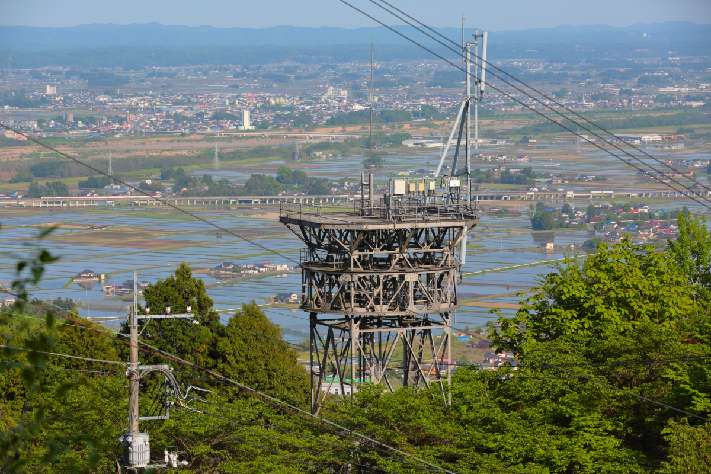
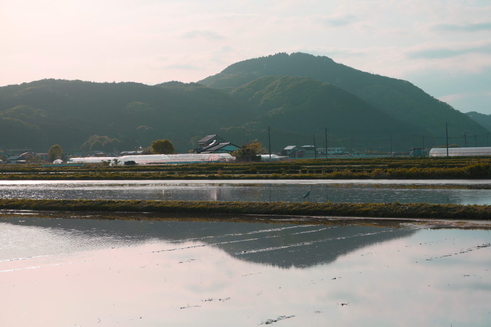

# hagurosan2

<html lang="ja">
 <head>
  <meta charset="utf-8" />
	 

<link href="https://cdnjs.cloudflare.com/ajax/libs/lightbox2/2.7.1/css/lightbox.css" rel="stylesheet">
 
</head>
<body>

  モバイル端末をお使いの場合は、画面を横向きにすると
  より見やすくご覧頂けます。

	

 アクセス用QRコード

<marquee direction="right" scrollamount="20" width="30%">(^_^)/~hada</marquee>

	
<h1><marquee behavior="alternate">!!! 2022年4月28日(木)連休前最終日は仕事も早々に切り上げて羽黒山へ !!!</marquee></h1>

	
<h3>背景は展望台付近のツツジ。</h3>
	
                            
<h3>展望台から見下ろす田園地帯は、ちょうど田植えの季節。</h3>

	
<h3>満開のツツジは見事でした。</h3>

	
<h3>こんなお花も咲いています。</h3>

	
<h3>山から降りて、この季節限定「田んぼリフレクション」など撮影。</h3>

	
<h3>羽黒山田んぼリフレクションを撮っていたら、後ろから「こんにちは！」と爽やかな挨拶。 帰宅途中の中学生が声をかけてくれました。 思わず後ろ姿をパチリ！</h3>	

	

<h3>上り、東北新幹線の動画です。この辺りでは200km/hオーバー。</h3>
<iframe width="560" height="315" src="https://www.youtube.com/embed/DspXhw1r1-8" title="YouTube video player" frameborder="0" allow="accelerometer; autoplay; clipboard-write; encrypted-media; gyroscope; picture-in-picture" allowfullscreen></iframe>

	
	
	
         
	

                                       

<marquee direction="left" scrollamount="5" width="85%">以上、ここまでご覧いただき、ありがとうございました！ (^_^)/~hada</marquee>

  

 

<!-- フッタ -->
 <footer>
 Copyright 2022/04/28 S.Hada
	 </footer>
